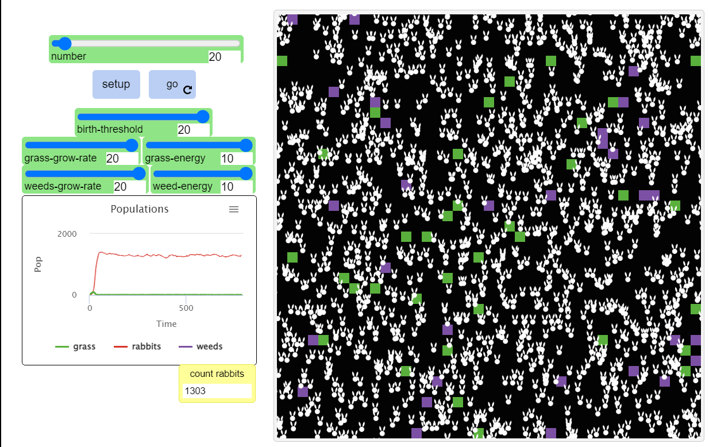

## Імітаційне моделювання комп'ютерних систем
## СПм-22-6, **Великодний Ігор Андрійович**
### Лабораторна робота №**1**. Опис імітаційних моделей та проведення обчислювальних експериментів

 

### Вибрана модель у середовищі NetLogo:
[Rabbits Grass Weeds](http://www.netlogoweb.org/launch#http://www.netlogoweb.org/assets/modelslib/Sample%20Models/Biology/Rabbits%20Grass%20Weeds.nlogo)

 

### Вербальний опис моделі:
Проект досліджує екосистему, що складається з кроликів, трави та бур'янів. Трава та бур'яни виростають у випадковому місці, кролики безладно блукають. Коли вони натикаються(їдять) на траву або бур'ян він отримує енергію. За достатньо накопиченої енергії кролик розмножується, якщо він не отримує достатньо енергії, він гине.

### Керуючі параметри:
- **number** початкова кількість кроликів у середовищі.
- **birth-threshold** рівень енергії, на якому кролик розмножується.
- **grass-grow-rate** швидкість росту трави.
- **grass-energy** кількість енергії в траві.
- **weeds-grow-rate** швидкість росту бур'янів.
- **weed-energy** кількість енергії в бур'яні.

### Внутрішні параметри:
- **rabbits, rabbit** перевизначення назви для черепах.
- **energy** додаткова змінна для кролів.

### Критерії ефективності системи:
- кількість трави за рівнем популяції кролів.
- поточна кількість популяції кролів.
- кількість бур'янів за рівнем популяції кролів.

### Примітки:
При налаштуваннях за замовчуванням кролі мають можливість отримати енергію тільки з трави, бо значення для бур'янів відсутні і вони не з'являться в симуляції.

### Недоліки моделі:
Велика смертність кролів.

 

## Обчислювальні експерименти

### 1. Шляхом зміни рівня енергії на якому кролі розмножується.

<table>
<thead>
<tr><th>Рівень енергії на якому кролик розмножується</th><th>Максимальне число кількості популяції кролів за кілька секунда після старту</th></tr>
</thead>
<tbody>
<tr><td>1</td><td>800</td></tr>
<tr><td>2</td><td>600</td></tr>
<tr><td>3</td><td>480</td></tr>
<tr><td>4</td><td>400</td></tr>
<tr><td>5</td><td>400</td></tr>
<tr><td>6</td><td>320</td></tr>
<tr><td>7</td><td>320</td></tr>
<tr><td>8</td><td>320</td></tr>
<tr><td>9</td><td>400</td></tr>
<tr><td>10</td><td>400</td></tr>
<tr><td>11</td><td>320</td></tr>
<tr><td>12</td><td>400</td></tr>
<tr><td>13</td><td>400</td></tr>
<tr><td>14</td><td>400</td></tr>
<tr><td>15</td><td>400</td></tr>
</tbody>
</table>

!(max_population.png)

### 2. Шляхом зміни рівня швидкості росту трави.

<table>
<thead>
<tr><th>Рівень швидкості росту трави</th><th>Поведінка екосистеми</th></tr>
</thead>
<tbody>
<tr><td>1</td><td>Система припиняє роботу в діапазоні {20, 60} тіків, кількість кролів - 0</td></tr>
<tr><td>2</td><td>В 20% система припинить роботу</td></tr>
<tr>Далі все працює стабільно</tr>
</tbody>
</table>

!(grass.png)

### 3. 