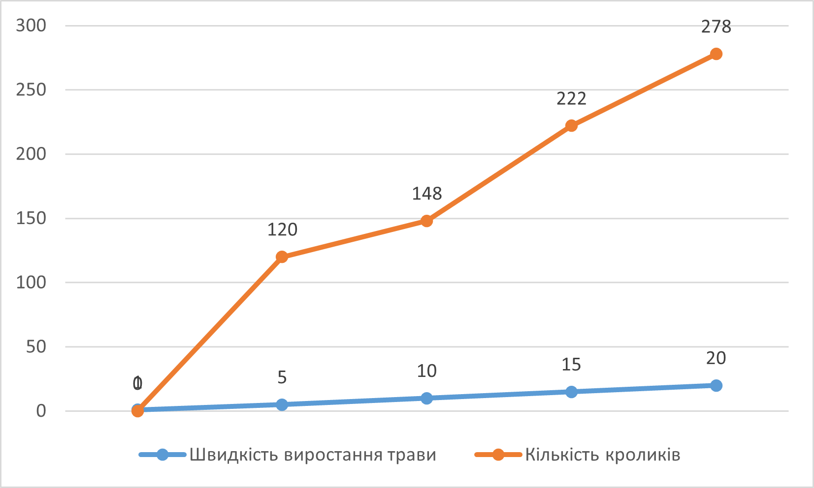
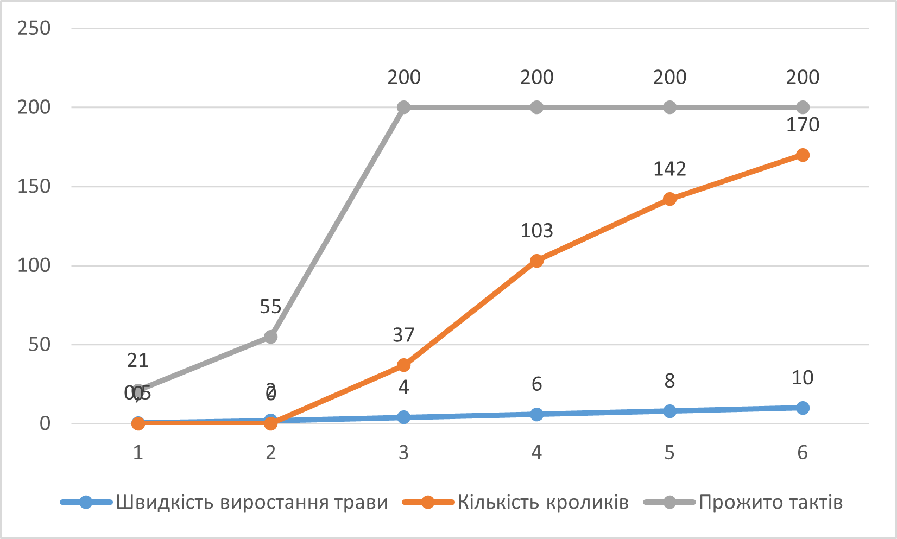
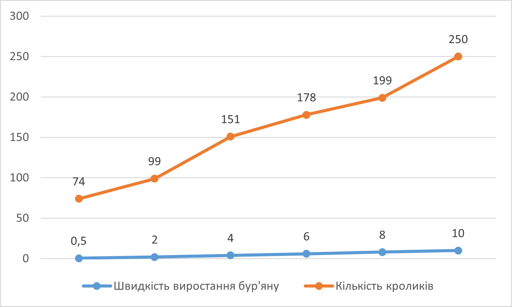

## Комп'ютерні системи імітаційного моделювання
## СПм-22-6, **Великодний Ігор Андрійович**
### Лабораторна робота №**1**. Опис імітаційних моделей та проведення обчислювальних експериментів

 

### Варіант 6, модель у середовищі NetLogo:
[Rabbits Grass Weeds](http://www.netlogoweb.org/launch#http://www.netlogoweb.org/assets/modelslib/Sample%20Models/Biology/Rabbits%20Grass%20Weeds.nlogo)

 

### Вербальний опис моделі:
Проста екосистема, де кролики блукають хаотично, а трава та бур'яни ростуть безладно. Коли кролик знаходить траву чи бур'ян, він споживає їх, отримуючи енергію. Розмноження кроликів залежить від отриманої енергії, в той час як нестача енергії призводить до їхньої загибелі. Можливе налаштування швидкості зростання трави та бур'янів, а також їхньої енергетичної цінності, що дозволяє досліджувати конкурентні переваги цих змінних у рамках моделі.

Керуючі параметри:
- **number** – визначає кількість кролів.
- **birth-threshold** - встановлює рівень енергії, при досягненні якого кролики починають розмножуватися.
- **Grass-Growth-Rate** – регулює швидкість росту трави.
- **weeds-growth-rate** – керує темпом розвитку бур'янів.
- **grass-energy** – кількість енергії, що отримується від поїдання трави.
- **weed-energy** - енергія, що отримується від поїдання бур'янів.

### Показники роботи системи:
- **count rabbits** – поточна кількість кроликів.
- **Population** – діаграма, що відображає кількісні властивості трави, кроликів, бур'янів.

### Примітки:
- Населення кроликів піддається загасаючим коливанням, стабілізуючись у вузькому діапазоні. Загальна кількість трави коливається, не збігаючись із чисельністю кроликів.
- Кролики одержують енергію, внаслідок чого відбувається їхнє розмноження. Збільшення чисельності кроликів призводить до дефіциту трави та цикл повторюється.
- На початку процесу кроликам не вистачає трав, і багато з них гине. Однак це сприяє вільному зростанню трав, забезпечуючи достатньо їжі для кроликів, що вижили.

### Недоліки моделі:
- Недолік обліку спраги конкуренції та "битв", характерних для реального життя.
– Відсутність здібності для кроликів отруїться бур'янами.
- Відсутність розмежування кроликів на особі чоловічої, жіночої та дитячої статі.

 

## Обчислювальні експерименти
### 1. Залежність кількості кроликів від швидкості виростання трави
Досліджується залежність кількості кроликів у симуляції протягом певної кількості тактів (200) від швидкості виростання трави.
Експерименти проводяться при 1-20 уо, з кроком 5, усього 5 симуляцій.  
Інші керуючі параметри мають значення за замовчуванням:
- **number** – 100
- **birth-threshold** - 15
- **weeds-growth-rate** – 0
- **grass-energy** – 5
- **weed-energy** - 0

<table>
<thead>
<tr><th>Швидкість виростання трави</th><th>Кількість кроликів</th></tr>
</thead>
<tbody>
<tr><td>1</td><td>0</td></tr>
<tr><td>5</td><td>120</td></tr>
<tr><td>10</td><td>148</td></tr>
<tr><td>15</td><td>222</td></tr>
<tr><td>20</td><td>278</td></tr>
</tbody>
</table>

Графік наочно показує, що при збільшенні кількості трави збільшується здатність кроликів розмножуватись а відповідно й кількість кроликів.

### 2. Залежність кількості кроликів від кількості енергії, що вони отримують від енергії трави
Досліджується залежність кількості кроликів у симуляції протягом певної кількості тактів (200) від енергії, що отримують кролики від трави.
Експерименти проводяться при 0,5-10 уо, усього 6 симуляцій.  
Інші керуючі параметри мають значення за замовчуванням:
- **number** – 100
- **birth-threshold** - 15
- **Grass-Growth-Rate** – 5
- **weeds-growth-rate** – 0
- **weed-energy** - 0

<table>
<thead>
<tr><th>Енергія від трави</th><th>Кількість кроликів</th><th>Прожито тактів</th></tr>
</thead>
<tbody>
<tr><td>0,5</td><td>0</td><td>21</td></tr>
<tr><td>2</td><td>0</td><td>55</td></tr>
<tr><td>4</td><td>37</td><td>200</td></tr>
<tr><td>6</td><td>103</td><td>200</td></tr>
<tr><td>8</td><td>142</td><td>200</td></tr>
<tr><td>10</td><td>170</td><td>200</td></tr>
</tbody>
</table>

Графік наочно показує, що підвищення кількості енергії, що отримують кролики від поїдання трави збільшує їх шанси виживання а також позитивно впливає на їх кількість.

### 3. Залежність кількості кроликів від кількості енергії, що вони отримують від бур'яну
Досліджується залежність кількості кроликів у симуляції протягом певної кількості тактів (200) від енергії, що отримують кролики від бур'яну та трави.
Експерименти проводяться при 0,5-10 уо, усього 6 симуляцій.  
Інші керуючі параметри мають значення за замовчуванням:
- **number** – 100
- **birth-threshold** - 15
- **Grass-Growth-Rate** – 5
- **weeds-growth-rate** – 5
- **grass-energy** – 5

<table>
<thead>
<tr><th>Енергія від бур'яну</th><th>Кількість кроликів</th></tr>
</thead>
<tbody>
<tr><td>0,5</td><td>74</td></tr>
<tr><td>2</td><td>99</td></tr>
<tr><td>4</td><td>151</td></tr>
<tr><td>6</td><td>178</td></tr>
<tr><td>8</td><td>199</td></tr>
<tr><td>10</td><td>250</td></tr>
</tbody>
</table>

Графік наочно показує, що додавання бур'яну окрім трави та підвищення отрумємої енергії від бур'яну підвищує швидкість розмноження кроликів.
